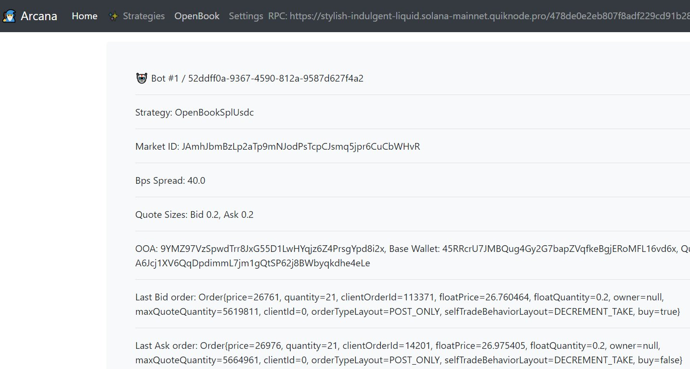

# Arcana Introduction

Arcana is a Java-based local web GUI for running automated bots and strategies on Solana DEXs. Arcana can be ran locally by the client as a Docker image and managed through a web browser interface. Overall this provides a browser-based, automated trading interface for strategies on Solana. There is no smart contract risk since Arcana runs offchain in your own Docker container.

### [Start using Arcana (Getting Started)](./gettingstarting.md)

## Benefits

- Provide liquidity on Solana markets, earn returns via market making
- No smart contract risk
- *Web GUI* for administration
- Run automated trading strategies with full self-custody

## Markets Supported

- [OpenBook](https://github.com/openbook-dex)
- TBD: Drift, Zeta, Phoenix

## Source Code

- [https://github.com/skynetcap/arcana](https://github.com/skynetcap/arcana)